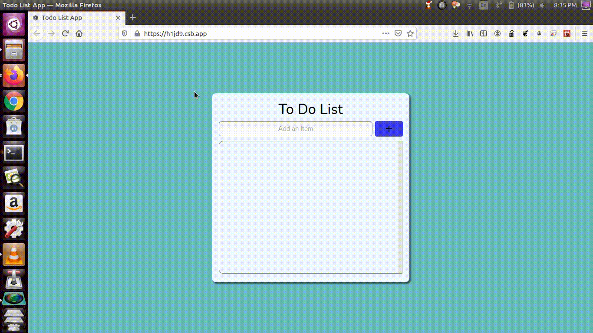

# To-Do-App-using-React.js
In this small project I have created a simple TO DO App using React (A powerful JavaScript library).

Used modern functional component implementation, also used the concept of conditionally rendering in React and most importantly I have used Material UI for fancy Icons and Buttons.

